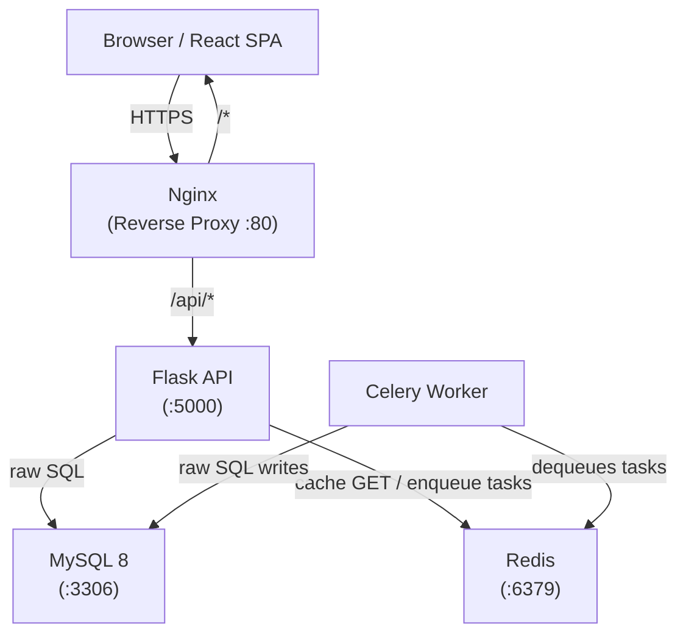
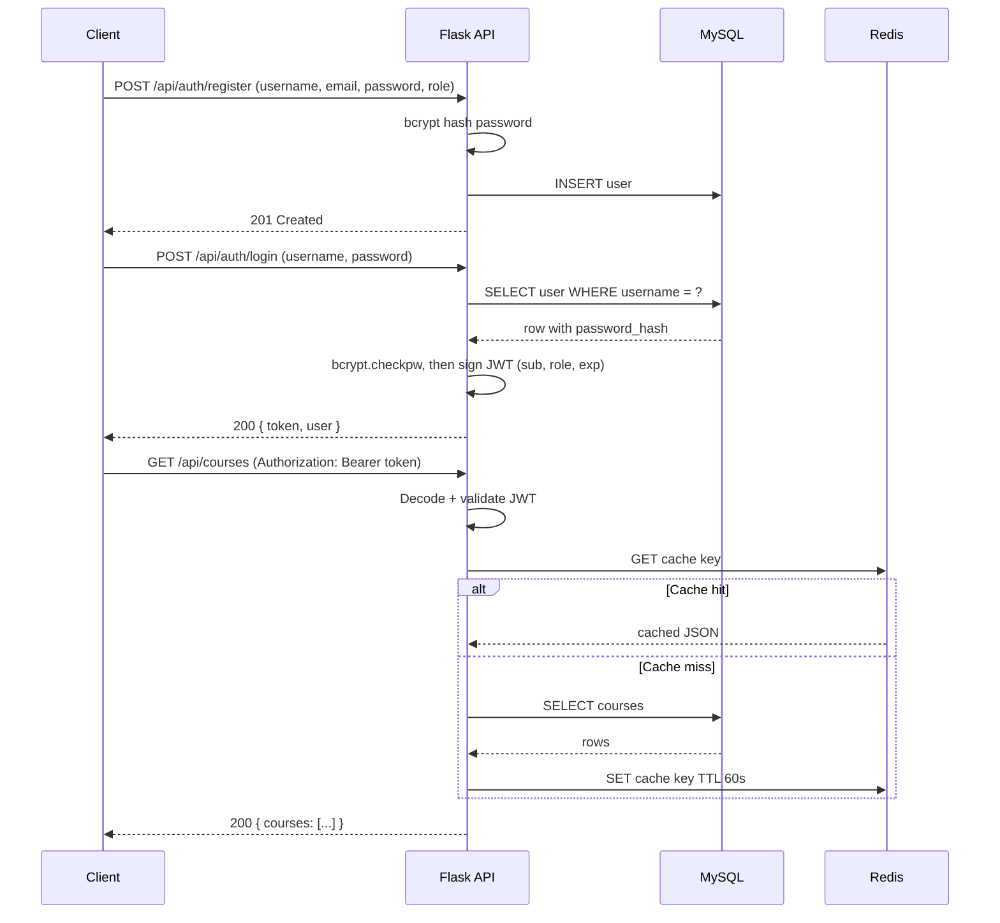
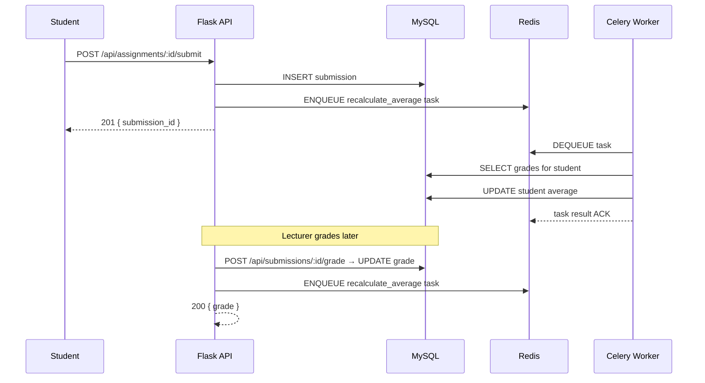
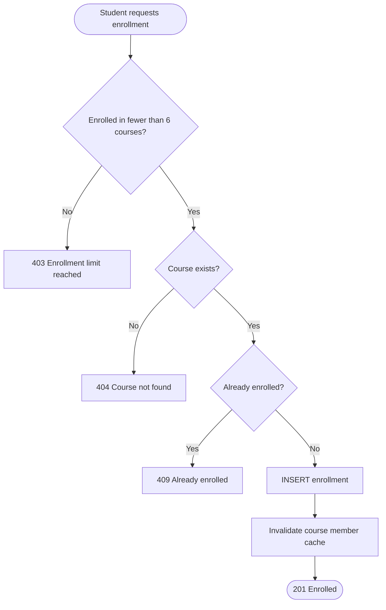
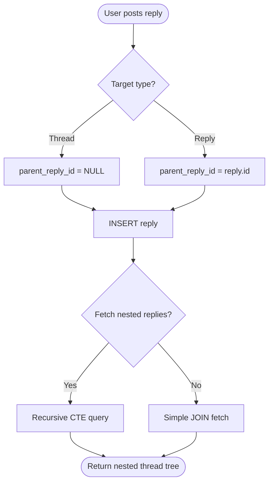

# COMP3161 — Course Management System (LMS)
## Architecture & Project Plan

> **Group Meeting Reference Document**
> Last updated: 2026-04-10

---

## Team

| Name | Role |
|---|---|
| **Camarly Thomas** | Lead — Infrastructure, Architecture, Auth, Frontend, Bonus |
| **Carl Heron** | Assignments, Grades, Reports |
| **Tramonique** | Forums, Threads, Replies + Postman |
| **Tam** | Courses, Enrollment, Calendar, Content + Postman |

---

## Tech Stack (Fixed)

| Layer | Technology |
|---|---|
| Backend | Python + Flask, raw SQL only (no ORM), MySQL 8 |
| Auth | Username + password (bcrypt) + JWT (PyJWT) |
| Cache + Task Broker | Redis |
| Task Queue | Celery |
| Frontend | React (Vite) |
| Containerisation | Docker + Docker Compose |
| Version Control | GitHub |
| API Style | REST — always returns JSON |

---

## 1. Architecture Overview

The system is composed of six discrete services, all orchestrated via Docker Compose and communicating over an internal Docker network.



### Service Responsibilities

| Service | Role |
|---|---|
| **Nginx** | Terminates HTTP, routes `/api/*` to Flask, serves React static build |
| **Flask API** | All business logic, raw SQL, JWT validation |
| **MySQL 8** | Single source of truth for all persistent data |
| **Redis** | Dual-purpose: Celery broker/result-backend + HTTP response cache |
| **Celery Worker** | Async tasks — bulk seeding, grade recalculation, notifications |
| **React (Vite)** | SPA frontend; built to static files, served by Nginx in production |

---

## 2. System Flow Diagrams

### Authentication Flow



### Assignment Submission & Grading Flow



### Course Enrollment Flow



### Forum & Nested Reply Flow



---

## 3. Database Tables

| Table | Description |
|---|---|
| `users` | All accounts (admin, lecturer, student) with bcrypt password hashes |
| `courses` | Course catalogue; each row references exactly one lecturer FK |
| `enrollments` | Junction table linking students to courses; enforces 6-course cap |
| `calendar_events` | Scheduled events scoped to a course with date, time, and description |
| `forums` | Discussion boards scoped to a course |
| `threads` | Top-level discussion topics inside a forum with title and opening body |
| `replies` | Posts inside a thread; self-referencing FK (`parent_reply_id`) enables infinite nesting |
| `content_sections` | Named groupings (e.g. "Week 1 Slides") belonging to a course |
| `content_items` | Individual resources (link, file URL, label) inside a content section |
| `assignments` | Assessments created by a lecturer for a course with due date and weight |
| `submissions` | A student's submitted work for an assignment (file URL, timestamp) |
| `grades` | Numeric score recorded by a lecturer against a submission |
| `student_averages` | Materialised average grade per student, updated asynchronously by Celery |

### SQL Views (for Reports)

| View | Description |
|---|---|
| `vw_courses_50_plus` | Courses where enrolled student count ≥ 50 |
| `vw_students_5_plus_courses` | Students enrolled in 5 or more courses |
| `vw_lecturers_3_plus_courses` | Lecturers teaching 3 or more courses |
| `vw_top10_enrolled_courses` | Top 10 courses ranked by enrollment count |
| `vw_top10_students_by_average` | Top 10 students ranked by overall average grade |

---

## 4. Complete REST API Endpoint Table

### Auth

| Method | Path | Auth | Role | Description |
|---|---|---|---|---|
| POST | `/api/auth/register` | No | any | Self-register (student/lecturer) with username + password |
| POST | `/api/auth/login` | No | any | Login with username + password, returns JWT |
| POST | `/api/auth/admin/create-user` | Yes | admin | Admin creates account for any user (incl. admin) |

### Users

| Method | Path | Auth | Role | Description |
|---|---|---|---|---|
| GET | `/api/users/me` | Yes | any | Get own profile |
| GET | `/api/users/:id` | Yes | admin | Get any user by ID |
| GET | `/api/users` | Yes | admin | List all users |

### Courses

| Method | Path | Auth | Role | Description |
|---|---|---|---|---|
| POST | `/api/courses` | Yes | admin | Create a new course |
| GET | `/api/courses` | Yes | any | Retrieve all courses |
| GET | `/api/courses/:id` | Yes | any | Retrieve a single course |
| GET | `/api/courses/:id/members` | Yes | any | Retrieve all members of a course |
| POST | `/api/courses/:id/enroll` | Yes | student | Self-enroll in a course |
| POST | `/api/courses/:id/assign-lecturer` | Yes | admin | Assign (or reassign) the single lecturer |
| GET | `/api/students/:id/courses` | Yes | admin, student | Courses a student is enrolled in |
| GET | `/api/lecturers/:id/courses` | Yes | admin, lecturer | Courses taught by a lecturer |

### Calendar Events

| Method | Path | Auth | Role | Description |
|---|---|---|---|---|
| POST | `/api/courses/:id/events` | Yes | lecturer, admin | Create a calendar event for a course |
| GET | `/api/courses/:id/events` | Yes | any | All calendar events for a course |
| GET | `/api/students/:id/events` | Yes | student, admin | Student events on a specific date (`?date=YYYY-MM-DD`) |

### Forums

| Method | Path | Auth | Role | Description |
|---|---|---|---|---|
| POST | `/api/courses/:id/forums` | Yes | lecturer, admin | Create a forum for a course |
| GET | `/api/courses/:id/forums` | Yes | any | All forums for a course |

### Threads

| Method | Path | Auth | Role | Description |
|---|---|---|---|---|
| POST | `/api/forums/:id/threads` | Yes | any | Create a new thread (title + opening post) |
| GET | `/api/forums/:id/threads` | Yes | any | All threads in a forum |
| GET | `/api/threads/:id` | Yes | any | Single thread with all nested replies |

### Replies

| Method | Path | Auth | Role | Description |
|---|---|---|---|---|
| POST | `/api/threads/:id/replies` | Yes | any | Reply directly to a thread |
| POST | `/api/replies/:id/replies` | Yes | any | Reply to a reply (nested) |

### Course Content

| Method | Path | Auth | Role | Description |
|---|---|---|---|---|
| POST | `/api/courses/:id/sections` | Yes | lecturer | Create a content section |
| GET | `/api/courses/:id/sections` | Yes | any | All sections with their content items |
| POST | `/api/sections/:id/items` | Yes | lecturer | Add a content item to a section |

### Assignments

| Method | Path | Auth | Role | Description |
|---|---|---|---|---|
| POST | `/api/courses/:id/assignments` | Yes | lecturer | Create an assignment |
| GET | `/api/courses/:id/assignments` | Yes | any | All assignments for a course |
| GET | `/api/assignments/:id` | Yes | any | Single assignment detail |
| POST | `/api/assignments/:id/submit` | Yes | student | Submit an assignment |
| GET | `/api/assignments/:id/submissions` | Yes | lecturer, admin | All submissions for an assignment |
| POST | `/api/submissions/:id/grade` | Yes | lecturer | Submit a grade for a submission |
| GET | `/api/students/:id/grades` | Yes | student, admin | All grades for a student |

### Reports

| Method | Path | Auth | Role | Description |
|---|---|---|---|---|
| GET | `/api/reports/courses-50-plus` | Yes | admin | Courses with ≥ 50 enrolled students |
| GET | `/api/reports/students-5-plus-courses` | Yes | admin | Students enrolled in ≥ 5 courses |
| GET | `/api/reports/lecturers-3-plus-courses` | Yes | admin | Lecturers teaching ≥ 3 courses |
| GET | `/api/reports/top10-enrolled-courses` | Yes | admin | Top 10 most enrolled courses |
| GET | `/api/reports/top10-students-by-average` | Yes | admin | Top 10 students by average grade |

---

## 5. Monorepo Folder & File Structure

```
course-management-system/
├── docker-compose.yml
├── .env.example
├── .gitignore
├── README.md
│
├── nginx/
│   ├── Dockerfile
│   └── nginx.conf
│
├── backend/
│   ├── Dockerfile
│   ├── requirements.txt
│   ├── .env.example
│   ├── run.py
│   │
│   ├── app/
│   │   ├── __init__.py
│   │   ├── config.py
│   │   ├── extensions.py
│   │   │
│   │   ├── db/
│   │   │   ├── __init__.py
│   │   │   ├── connection.py
│   │   │   └── migrations/
│   │   │       ├── 001_create_users.sql
│   │   │       ├── 002_create_courses.sql
│   │   │       ├── 003_create_enrollments.sql
│   │   │       ├── 004_create_calendar_events.sql
│   │   │       ├── 005_create_forums.sql
│   │   │       ├── 006_create_threads.sql
│   │   │       ├── 007_create_replies.sql
│   │   │       ├── 008_create_content_sections.sql
│   │   │       ├── 009_create_content_items.sql
│   │   │       ├── 010_create_assignments.sql
│   │   │       ├── 011_create_submissions.sql
│   │   │       ├── 012_create_grades.sql
│   │   │       ├── 013_create_student_averages.sql
│   │   │       └── 014_create_views.sql
│   │   │
│   │   ├── middleware/
│   │   │   ├── __init__.py
│   │   │   ├── auth.py
│   │   │   └── roles.py
│   │   │
│   │   ├── routes/
│   │   │   ├── __init__.py
│   │   │   ├── auth.py
│   │   │   ├── users.py
│   │   │   ├── courses.py
│   │   │   ├── enrollments.py
│   │   │   ├── calendar_events.py
│   │   │   ├── forums.py
│   │   │   ├── threads.py
│   │   │   ├── replies.py
│   │   │   ├── content.py
│   │   │   ├── assignments.py
│   │   │   ├── submissions.py
│   │   │   ├── grades.py
│   │   │   └── reports.py
│   │   │
│   │   ├── services/
│   │   │   ├── __init__.py
│   │   │   ├── auth_service.py
│   │   │   ├── user_service.py
│   │   │   ├── course_service.py
│   │   │   ├── enrollment_service.py
│   │   │   ├── calendar_service.py
│   │   │   ├── forum_service.py
│   │   │   ├── thread_service.py
│   │   │   ├── reply_service.py
│   │   │   ├── content_service.py
│   │   │   ├── assignment_service.py
│   │   │   ├── submission_service.py
│   │   │   ├── grade_service.py
│   │   │   └── report_service.py
│   │   │
│   │   ├── cache/
│   │   │   ├── __init__.py
│   │   │   ├── client.py
│   │   │   └── keys.py
│   │   │
│   │   └── tasks/
│   │       ├── __init__.py
│   │       ├── celery_app.py
│   │       ├── seed_tasks.py
│   │       ├── grade_tasks.py
│   │       └── notification_tasks.py
│   │
│   └── seed/
│       ├── __init__.py
│       ├── seed_runner.py
│       ├── seed_users.py
│       ├── seed_courses.py
│       ├── seed_enrollments.py
│       └── seed_assignments.py
│
├── frontend/
│   ├── Dockerfile
│   ├── package.json
│   ├── vite.config.js
│   ├── index.html
│   │
│   └── src/
│       ├── main.jsx
│       ├── App.jsx
│       │
│       ├── api/
│       │   ├── client.js
│       │   ├── auth.js
│       │   ├── courses.js
│       │   ├── forums.js
│       │   ├── assignments.js
│       │   ├── reports.js
│       │   └── calendar.js
│       │
│       ├── context/
│       │   └── AuthContext.jsx
│       │
│       ├── components/
│       │   ├── Navbar.jsx
│       │   ├── ProtectedRoute.jsx
│       │   ├── CourseCard.jsx
│       │   ├── ThreadList.jsx
│       │   ├── ReplyTree.jsx
│       │   ├── AssignmentCard.jsx
│       │   └── GradeTable.jsx
│       │
│       └── pages/
│           ├── LoginPage.jsx
│           ├── RegisterPage.jsx
│           ├── DashboardPage.jsx
│           ├── CoursePage.jsx
│           ├── ForumPage.jsx
│           ├── ThreadPage.jsx
│           ├── AssignmentsPage.jsx
│           ├── ContentPage.jsx
│           ├── CalendarPage.jsx
│           └── ReportsPage.jsx
│
├── postman/
│   ├── LMS_Collection.postman_collection.json
│   └── LMS_Environment.postman_environment.json
│
├── .github/
│   └── workflows/
│       ├── ci.yml
│       └── deploy.yml
│
└── docs/
    ├── architecture.md
    ├── api.md
    ├── db-schema.md
    └── diagrams/
        ├── architecture.mmd
        ├── auth-flow.mmd
        ├── enrollment-flow.mmd
        └── submission-flow.mmd
```

---

## 6. Team Stream Breakdown

> **Ground rule for Carl, Tramonique, and Tam:**
> Your job is to write Flask route functions and service functions only.
> Do not touch Docker, Nginx, Redis config, Celery config, middleware, or auth.
> Camarly will provide you with the decorators, helpers, and DB connection — just use them.

---

### Camarly Thomas — Stream A: Infrastructure, Auth & Foundation

**Responsibility:** Everything that everyone else depends on. Sets up before anyone else starts coding.

**Owns:**
- `docker-compose.yml`
- `nginx/` (entire directory)
- `backend/Dockerfile`, `backend/requirements.txt`, `backend/run.py`
- `backend/app/__init__.py`, `config.py`, `extensions.py`
- `backend/app/db/connection.py`
- `backend/app/db/migrations/` (all 14 migration files)
- `backend/app/middleware/auth.py`, `roles.py`
- `backend/app/routes/auth.py`, `users.py`
- `backend/app/services/auth_service.py`, `user_service.py`
- `backend/app/cache/client.py`, `keys.py`
- `backend/app/tasks/celery_app.py`
- `frontend/` (entire directory — all pages, components, API modules, context)
- `.github/workflows/ci.yml`, `deploy.yml`
- All bonus features (see Bonus section)

**Implements:**
- All `/api/auth/*` endpoints
- All `/api/users/*` endpoints
- `get_current_user()` — returns `{ id, role }` decoded from JWT
- `@require_role(*roles)` — Flask route decorator used by all streams
- `cache_get(key)` / `cache_set(key, value, ttl)` — Redis helpers used by all streams
- `db.get_connection()` — MySQL connection factory used by all streams
- Full Docker Compose stack bringing up all six services with one command
- React SPA consuming all API endpoints

**Produces (shared contract other streams must not modify):**

```
get_current_user()        → { id, role }
@require_role("admin")    → Flask decorator
cache_get(key)            → value or None
cache_set(key, val, ttl)  → None
db.get_connection()       → MySQL connection
```

---

### Carl Heron — Stream D: Assignments, Grades & Reports

**Responsibility:** Write the Flask route functions and service functions for assignments, grading, and report endpoints. Use the shared helpers Camarly provides.

**Owns:**
- `backend/app/routes/assignments.py`
- `backend/app/routes/submissions.py`
- `backend/app/routes/grades.py`
- `backend/app/routes/reports.py`
- `backend/app/services/assignment_service.py`
- `backend/app/services/submission_service.py`
- `backend/app/services/grade_service.py`
- `backend/app/services/report_service.py`

**Implements:**

| Method | Path | Description |
|---|---|---|
| POST | `/api/courses/:id/assignments` | Lecturer creates an assignment |
| GET | `/api/courses/:id/assignments` | List all assignments for a course |
| GET | `/api/assignments/:id` | Get single assignment detail |
| POST | `/api/assignments/:id/submit` | Student submits an assignment |
| GET | `/api/assignments/:id/submissions` | Lecturer views all submissions |
| POST | `/api/submissions/:id/grade` | Lecturer grades a submission |
| GET | `/api/students/:id/grades` | Get all grades for a student |
| GET | `/api/reports/courses-50-plus` | Report: courses with ≥ 50 students |
| GET | `/api/reports/students-5-plus-courses` | Report: students in ≥ 5 courses |
| GET | `/api/reports/lecturers-3-plus-courses` | Report: lecturers teaching ≥ 3 courses |
| GET | `/api/reports/top10-enrolled-courses` | Report: top 10 most enrolled courses |
| GET | `/api/reports/top10-students-by-average` | Report: top 10 students by average grade |

**Dependencies on Camarly:**
- `@require_role` decorator on every route
- `db.get_connection()` for all SQL
- `cache_get` / `cache_set` on all report GET endpoints

**Frontend colour / style contribution:**
- Suggest a colour palette and component style for the Grades and Reports pages (table styles, badge colours for grade ranges, chart palette if any)

---

### Tramonique — Stream C: Forums, Threads & Nested Replies

**Responsibility:** Write the Flask route functions and service functions for the forum discussion system. The reply-to-reply nesting is the key challenge here — think of it like Reddit threads.

**Owns:**
- `backend/app/routes/forums.py`
- `backend/app/routes/threads.py`
- `backend/app/routes/replies.py`
- `backend/app/services/forum_service.py`
- `backend/app/services/thread_service.py`
- `backend/app/services/reply_service.py`
- `postman/LMS_Collection.postman_collection.json` *(shared with Tam)*
- `postman/LMS_Environment.postman_environment.json` *(shared with Tam)*

**Implements:**

| Method | Path | Description |
|---|---|---|
| POST | `/api/courses/:id/forums` | Lecturer/admin creates a forum |
| GET | `/api/courses/:id/forums` | All forums for a course |
| POST | `/api/forums/:id/threads` | Create a thread (title + opening post) |
| GET | `/api/forums/:id/threads` | All threads in a forum |
| GET | `/api/threads/:id` | Single thread with full nested reply tree |
| POST | `/api/threads/:id/replies` | Reply directly to a thread |
| POST | `/api/replies/:id/replies` | Reply to a reply (nested, unlimited depth) |

**Key concept — nested replies:**
The `replies` table has a `parent_reply_id` column that points back to itself. Fetching a full thread tree requires a recursive SQL query (Common Table Expression). Camarly will provide the query pattern — your job is to call it correctly from the service and return a nested JSON structure.

**Postman responsibilities (shared with Tam):**
- Document every endpoint in the Postman collection with example request bodies and expected responses
- Set up environment variables for `base_url`, `jwt_token`, sample IDs
- Include happy-path requests AND error cases (401, 403, 404, 409) for your stream's endpoints

**Dependencies on Camarly:**
- `@require_role` decorator on every route
- `db.get_connection()` for all SQL

**Frontend colour / style contribution:**
- Suggest a colour palette and typography style for the Forum and Thread pages (thread card layout, reply indentation visual style, accent colours)

---

### Tam — Stream B: Courses, Enrollment & Calendar

**Responsibility:** Write the Flask route functions and service functions for courses, student enrollment, calendar events, and course content.

**Owns:**
- `backend/app/routes/courses.py`
- `backend/app/routes/enrollments.py`
- `backend/app/routes/calendar_events.py`
- `backend/app/routes/content.py`
- `backend/app/services/course_service.py`
- `backend/app/services/enrollment_service.py`
- `backend/app/services/calendar_service.py`
- `backend/app/services/content_service.py`
- `postman/LMS_Collection.postman_collection.json` *(shared with Tramonique)*
- `postman/LMS_Environment.postman_environment.json` *(shared with Tramonique)*

**Implements:**

| Method | Path | Description |
|---|---|---|
| POST | `/api/courses` | Admin creates a course |
| GET | `/api/courses` | Retrieve all courses |
| GET | `/api/courses/:id` | Retrieve a single course |
| GET | `/api/courses/:id/members` | All members of a course |
| POST | `/api/courses/:id/enroll` | Student self-enrolls |
| POST | `/api/courses/:id/assign-lecturer` | Admin assigns a lecturer |
| GET | `/api/students/:id/courses` | Courses for a specific student |
| GET | `/api/lecturers/:id/courses` | Courses for a specific lecturer |
| POST | `/api/courses/:id/events` | Create a calendar event |
| GET | `/api/courses/:id/events` | All events for a course |
| GET | `/api/students/:id/events` | Student events on a date (`?date=`) |
| POST | `/api/courses/:id/sections` | Create a content section |
| GET | `/api/courses/:id/sections` | All sections with items |
| POST | `/api/sections/:id/items` | Add a content item |

**Key business rules to enforce in service code:**
- A student cannot enroll in more than 6 courses → return 403 if violated
- A course can have only one lecturer → assign-lecturer replaces, not appends
- A lecturer cannot be assigned to more than 5 courses → return 403 if violated

**Postman responsibilities (shared with Tramonique):**
- Document every endpoint in the Postman collection with example request bodies and expected responses
- Cover all three user roles (admin, lecturer, student) where relevant
- Include enrollment limit error cases and date filter examples for calendar

**Dependencies on Camarly:**
- `@require_role` decorator on every route
- `db.get_connection()` for all SQL
- `cache_get` / `cache_set` on course list and member list GETs

**Frontend colour / style contribution:**
- Suggest a colour palette and card layout style for the Course Dashboard, Enrollment, and Calendar pages (course card design, calendar event chip colours, enrollment status indicators)

---

## 7. JSON Response Conventions

All endpoints must follow this envelope — no exceptions.

**Success:**
```json
{
  "data": { } or [ ],
  "message": "optional string"
}
```

**Error:**
```json
{
  "error": "machine_readable_code",
  "message": "Human readable description"
}
```

**Standard HTTP status codes:**

| Code | Meaning |
|---|---|
| 200 | OK (GET, PUT) |
| 201 | Created (POST) |
| 400 | Bad request / validation failure |
| 401 | Missing or invalid JWT |
| 403 | Wrong role or business rule violation |
| 404 | Resource not found |
| 409 | Conflict (duplicate enrollment, username taken) |
| 500 | Unexpected server error |

---

## 8. GitHub Branch Strategy

```
main
└── develop
    ├── camarly/auth-infrastructure
    ├── camarly/jwt-middleware
    ├── camarly/user-endpoints
    ├── camarly/frontend
    ├── carl/assignments-grades
    ├── carl/reports-views
    ├── tramonique/forums-threads
    ├── tramonique/nested-replies
    ├── tam/courses-enrollment
    ├── tam/calendar-content
    └── shared/postman-collection
```

### Rules

| Branch | Purpose |
|---|---|
| `main` | Production-ready, protected — PR required, CI must pass |
| `develop` | Integration branch — all stream PRs merge here first |
| `camarly/*` | Camarly's feature branches |
| `carl/*` | Carl's feature branches |
| `tramonique/*` | Tramonique's feature branches |
| `tam/*` | Tam's feature branches |
| `shared/postman-collection` | Shared Postman file — both Tramonique and Tam commit here |

- No direct pushes to `main` or `develop`
- All PRs target `develop` and require at least one review
- CI runs on every push to any feature branch
- `develop` → `main` via release PR at the end of each phase

---

## 9. Docker Compose Services

| Service | Image / Build | Internal Port | Host Port | Notes |
|---|---|---|---|---|
| `nginx` | `./nginx` | 80 | 80 | Reverse proxy + static React file server |
| `api` | `./backend` | 5000 | — | Flask app; internal only, not exposed |
| `db` | `mysql:8` | 3306 | 3306 | Persistent volume `mysql_data` |
| `redis` | `redis:7-alpine` | 6379 | — | Cache + Celery broker; internal only |
| `celery_worker` | `./backend` | — | — | Same image as `api`; runs Celery worker entrypoint |
| `frontend` | `./frontend` | 5173 | 5173 | Dev server only; built to static in production |

---

## 10. Development Phases

### Phase 1 — Database Schema & Auth
**Owner: Camarly Thomas**

Everything else is blocked until this is done. This phase produces the shared foundation.

- Docker Compose up: MySQL, Redis, Flask skeleton, Celery worker
- All 14 migration files written and applied in order
- `users` table, bcrypt password hashing, JWT sign + verify
- `@require_role` decorator available and tested
- `db.get_connection()` stable and documented for other streams
- Redis cache helpers written and tested
- Celery app wired to Redis broker, test task confirmed running
- Minimal React login page hitting the real `/api/auth/login` and `/api/users/me`

**Exit criteria:** `POST /api/auth/register` and `POST /api/auth/login` return valid JWTs. A protected test route returns 401 without a token and 200 with one. `docker compose up` starts all services without errors.

---

### Phase 2 — Core API Routes
**Owners: Carl, Tramonique, Tamarica (parallel after Phase 1 merges)**

Each stream works on its own branch off `develop` after pulling Phase 1.
The first PR is scoped small so every teammate hits a real milestone fast.

**First-PR scope (turns stub tests green, unblocks the team):**
- **Tamarica:** `POST /api/courses`, `GET /api/courses`, `GET /api/courses/:id`
- **Tramonique:** `POST /api/courses/:id/forums`, `GET /api/courses/:id/forums`
- **Carl:** `POST /api/courses/:id/assignments`, `GET /api/courses/:id/assignments`, `GET /api/assignments/:id`

Each first-PR test file already lives in `backend/tests/` and fails until
the teammate implements their three functions + route wiring. Once
`pytest tests/test_<stream>.py` is green the teammate opens a PR into
`develop`. Camarly reviews, merges, and the next slice of TODOs in each
teammate's guide becomes available.

**Follow-up PRs (after the first merge):**
- **Tamarica:** enrollment (6-course cap), calendar events, content sections
- **Tramonique:** threads, nested replies (recursive CTE), reply-to-reply
- **Carl:** submissions, grading endpoint, student grades endpoint

**Camarly in parallel:**
- Reviews teammate PRs for correct use of `@require_role` and `get_connection`
- Adds Redis cache calls to team GET routes on review (doesn't block their PR)
- Polishes shared patterns, commits small fixes to `develop`

**Exit criteria:** Every endpoint in the API table returns the correct status code and JSON shape when called with a valid JWT from Postman. `pytest` is green end-to-end.

---

### Phase 3 — Seeding, Reports & Async Tasks
**Owner: Camarly Thomas + Carl Heron**

- **Camarly:** Celery bulk seed task — 100k+ students, 200+ courses, all constraint rules met (chunked inserts)
- **Camarly:** Wire the async Celery grade recalculation task into `grade_service.py` (replaces Carl's synchronous first pass)
- **Carl:** Five report endpoints returning correct data from the SQL views shipped in migration 014
- **All streams:** Cache invalidation wired to every mutating POST route
- **Tramonique + Tamarica:** Postman collection fully documented with seeded data IDs

**Exit criteria:** Seed completes without errors in under 10 minutes. All report endpoints return correct data against the seeded dataset. Celery processes the grade recalculation task from the queue.

---

### Phase 4 — Frontend, Bonus & Polish
**Owner: Camarly Thomas (with style input from Carl, Tramonique, Tamarica)**

Runs concurrent with Phase 3. The Phase 1 login page is already live —
Phase 4 builds the rest of the React SPA on top of it.

- React pages consuming all API modules (dashboard, courses, forums, assignments, reports)
- UI styled according to colour suggestions collected from team in group meeting
- GitHub Actions CI pipeline (lint + test on every PR)
- Nginx production config (proxy + static build serving)
- Database indexes on FK columns and high-cardinality filter columns
- End-to-end walkthrough of every user journey in the browser

**Exit criteria:** Full student, lecturer, and admin journeys completable in the browser. CI passes on `develop`. `docker compose up --build` runs the complete production stack.

---

## 11. Bonus Features Checklist
**All owned by Camarly Thomas**

| Feature | Notes |
|---|---|
| Redis caching on all expensive GETs | Key format: `lms:<resource>:<id>`, TTL 60s |
| Cache invalidation on all mutations | Each POST/DELETE calls `cache_del` on affected keys |
| Celery async grade recalculation | Triggered after every grade write by Carl's service |
| Celery bulk seeding task | Chunked batch inserts, not one row per query |
| Docker Compose full-stack | Single `docker compose up` starts all 6 services |
| GitHub Actions CI | Runs lint + tests on every push to any feature branch |
| React SPA frontend | All pages, components, routing, and API integration |
| DB indexes on FK + filter columns | Identified with EXPLAIN on the 5 report queries |
| JWT on every non-auth route | Enforced via `@require_role` decorator |

---

## 12. Frontend Colour Scheme — Input Requested from Team

> Camarly will implement the frontend. The team is asked to suggest styles for their domain pages.
> Bring ideas to the group meeting. Consider the overall feel: academic, clean, modern.

| Domain | Input Requested From | Pages Covered |
|---|---|---|
| Courses, Enrollment, Calendar | **Tam** | Dashboard, Course cards, Calendar event chips, Enrollment badges |
| Forums, Threads, Replies | **Tramonique** | Forum list, Thread cards, Reply indentation colours, Nested reply tree |
| Grades, Reports | **Carl** | Grade table colours, Grade range badges (A/B/C/F), Report table accents |
| Auth, Global Shell | **Camarly** | Login page, Navbar, Global colour tokens, Typography scale |

**Suggested format for style input:**
- Primary colour (hex or name)
- Accent / highlight colour
- Background colour
- Any reference sites or apps you like the look of

---

## 13. Postman Collection Responsibilities

**Owners: Tramonique and Tam** — branch `shared/postman-collection`

### What to include

- One folder per resource group (Auth, Courses, Forums, Assignments, Reports, etc.)
- Every endpoint documented with:
  - Example request body (where applicable)
  - Example success response
  - At least one error case (wrong role, missing field, limit exceeded)
- Environment file variables:
  - `{{base_url}}` — default `http://localhost:80`
  - `{{jwt_admin}}`, `{{jwt_lecturer}}`, `{{jwt_student}}`
  - `{{course_id}}`, `{{forum_id}}`, `{{thread_id}}`, `{{assignment_id}}`, `{{submission_id}}`

### Split

| Owner | Postman Folders |
|---|---|
| **Tramonique** | Auth, Forums, Threads, Replies, Grades, Reports |
| **Tam** | Courses, Enrollment, Calendar Events, Content, Assignments, Submissions |

Both collaborate on the shared environment file and agree on variable names before writing requests.

---

## 14. Project Constraints Reference

Quick reference for the spec rules that affect business logic:

| Rule | Enforced In |
|---|---|
| Only 1 lecturer per course | `course_service.py` (Tam) |
| Student max 6 courses | `enrollment_service.py` (Tam) |
| Lecturer max 5 courses | `course_service.py` (Tam) |
| Student min 3 courses (seeding only) | `seed_enrollments.py` (Camarly) |
| Lecturer min 1 course (seeding only) | `seed_courses.py` (Camarly) |
| Each course min 10 members (seeding only) | `seed_enrollments.py` (Camarly) |
| Seed: ≥ 100,000 students | `seed_users.py` (Camarly) |
| Seed: ≥ 200 courses | `seed_courses.py` (Camarly) |
| No ORM — raw SQL only | All streams — enforced in code review |
